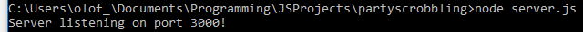
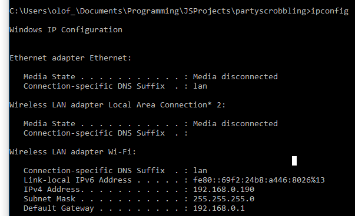

### Host the server yourself: 

* You will need to run my web server on your computer to host a session. 
* My server is written with JavaScript so you need to download [node.js](https://nodejs.org/en/) (a neat JS engine that runs on your computer instead of browser).
* The server fetches the most recent track, one at a time, from a specific LAST.FM user which you provide as a parameter when you launch the application.
* Because of this the who is currently scrobbling should host the server.

#### Start the server:

1. Download the code from the 'singlehost' branch. Might need some modifications to work.
2. Start the command prompt where the folder is or navigate to the folder through the command prompt.
3. When you're in the right location, start the server by typing: node server.js _USERNAME_. _USERNAME_ is the username of the host.  
4. If everything is fine you should see something like: 

5. Find and share your ipv4 address by starting the command prompt and typing _ipconfig_. Should look something like this: 

#### Users on the same network can now visit the application:

1. Start your browser.
2. Enter _yourhostsipv4address:3000_ as URL.

#### You need to confirm that this application is allowed to scrobble for you: 

1. Add _/authenticate_ to the url. 
2. You will be redirected to a last.fm page with a small description of the app.
3. Accept and you'll be redirected to the start page of the application.
4. Now enter your last.fm username into the textfield and press submit. 
5. The server adds your name and your token to a list. 
6. You will now be included when the next track scrobbles.

#### "WOW THATS JUST TOO MANY STEPS MAN" 

I know! Just use the hosted version. I added this readme for some friends before I decided to make it work live. Felt sad removing all the text I wrote.